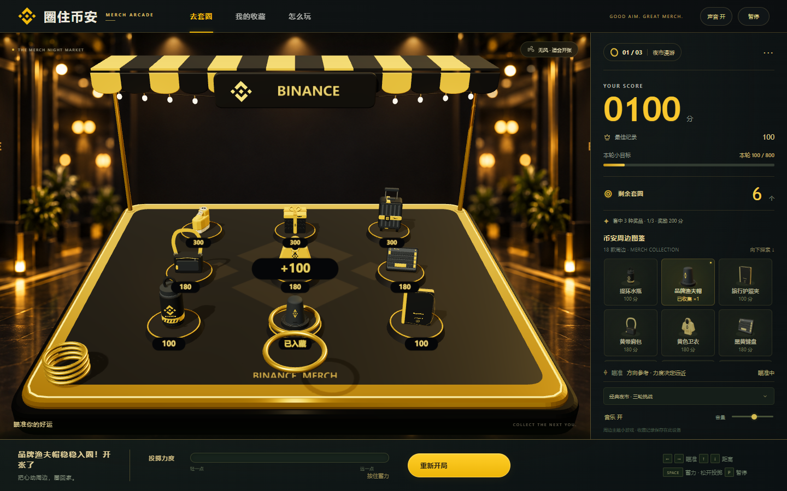

# 圈住币安 · MERCH ARCADE

一个黑金夜市风格的 3D 币安周边套圈小游戏。

**[打开在线游戏](https://xhuozhong.github.io/binance-merch-ring-toss/)**



## 玩法

- 移动鼠标或手指选择方向，按住场景蓄力，松开投圈。
- 方向键调整方向与角度；空格蓄力、松开投掷；P / Esc 暂停。
- 圈受重力、摩擦、弹性和侧风影响，会擦碰、回弹、翻转与滑落；稳定套住周边才计分。
- 不显示最佳蓄力区间或预测轨迹，需要练习控制力度。
- 经典模式三轮，每轮七个圈；另有每日挑战和无限练习。练习中可用“换一批”更换周边。

## 内容

18 类周边：水瓶、渔夫帽、护照夹、肩包、卫衣、键盘、定制鞋、端午礼盒、旅行箱、帆布袋、T 恤、袜子、收拢伞、筋膜枪、网球拍（概念款）、海滩巾、睡衣与网球套装。

原创轻松背景音乐，独立音乐音量和碰撞音效。收藏、纪录与声音设置仅保存在当前浏览器本机。

## 本地运行

下载仓库后，用 Edge 或 Chrome 打开 index.html 即可。也可以运行：

```sh
node serve.cjs
```

然后访问 http://127.0.0.1:4173 。无需安装依赖，游戏运行没有外部接口、字体、音频或模型请求。

## 发布

GitHub Pages 使用 main 分支的仓库根目录，.nojekyll 使游戏作为静态文件直接发布。所有资源使用相对路径，支持仓库子路径。

## 实现与素材

Three.js 负责实时三维场景，Cannon.js 负责刚体碰撞；背景音乐和音效使用 Web Audio。两项第三方依赖均使用 MIT 许可，完整许可文件为 THREE-LICENSE.txt 与 CANNON-LICENSE.txt。

游戏程序化模型、图鉴缩略图与合成音乐为本项目制作；概念图及场景背景由图像生成工具制作。黑金品牌视觉参考可见 [概念图](concept-black-gold.png)。周边为游戏化表现，不是商品照片；网球拍保留概念款标识。

奖品采用固定的简化碰撞体，不模拟布料变形或奖品被撞倒。桌面、触屏模拟与离线功能已验证；不同设备的加载时间和帧率可能不同。
