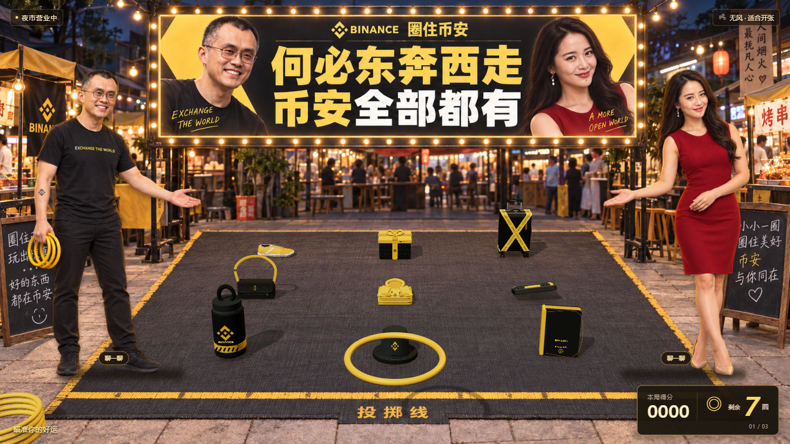

# 圈住币安 · 夜市套圈

[在线试玩](https://xhuozhong.github.io/binance-merch-ring-toss/)

写实夜市场景、品牌招牌、两位原地待机摊主，以及19款品牌主题周边。黄白运动鞋、亮黄印字行李箱和黑金交叉带行李箱按用户实物参考制作。

## 玩法

移动鼠标或手指瞄准，按住蓄力，松开投掷。方向键和空格也可操作。经典三轮挑战、每日固定场地、无限练习；图鉴可查看收藏，练习模式可换一批。

圈与奖品使用刚体接触：轻物可滑动和倾倒，重物更稳定；圈受重力、摩擦和角动量影响，稳定套住才得分。不提供最佳蓄力区间。场景还藏着一项很难达成的NPC挑战。

## 声音

背景乐使用用户提供的完整MP3循环播放，首次点击开始后播放。音乐独立开关与音量，暂停时续播位置保留，投掷/碰撞等合成音效独立混音。

## 运行

静态页面，无需安装依赖。下载后运行 `node serve.cjs`，访问 http://127.0.0.1:4173 。GitHub Pages从main根目录发布。收藏与设置保存在此浏览器设备。

## 实现

Three.js + Cannon.js；写实背景和人物来自生成素材，19款奖品使用真正的三维几何，鞋面与分层鞋底、双半箱壳和轮子、折叠衣物与织纹分别建模；碰撞体与模型尺寸对齐，包的提手采用分段碰撞。不模拟布料变形或完整扫描模型。NPC使用轻量二维变形和眨眼，并非Cubism模型。相关依赖MIT许可见THREE-LICENSE.txt与CANNON-LICENSE.txt。主题创作小游戏，奖品与隐藏奖励均为游戏内表现。
